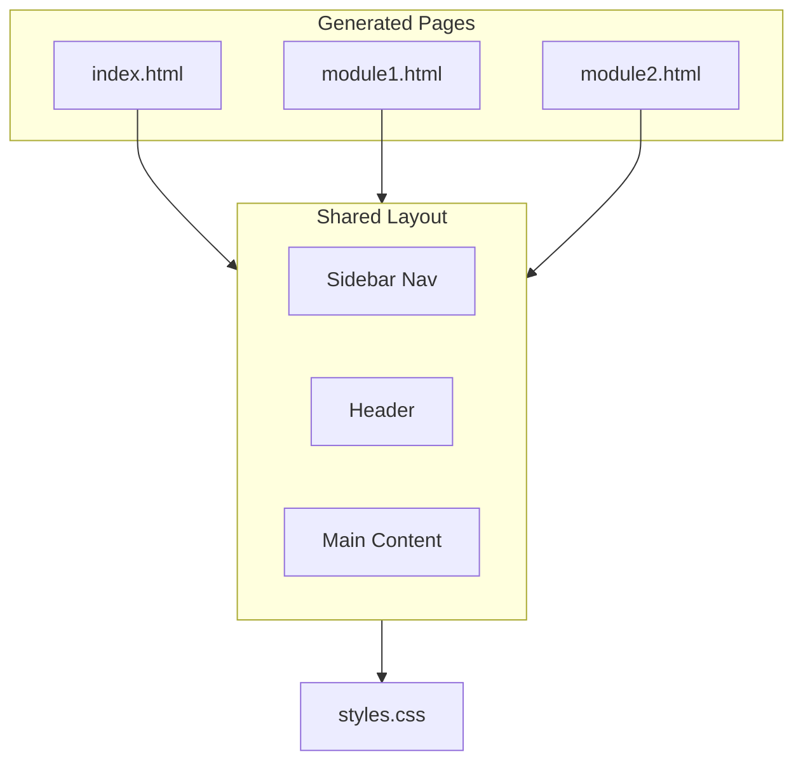
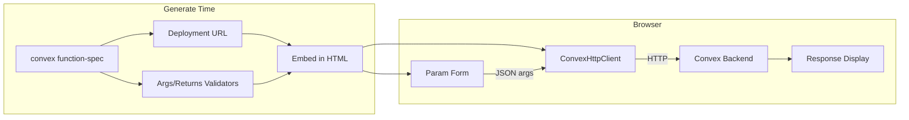

# ConvexDoc Premium UI Revamp

## Positioning: Convex-Specific Swagger

ConvexDoc is **Swagger UI for Convex** — interactive API documentation built for Convex developers. The key differentiator is built-in Convex integration:

- **Run functions** directly from the docs (queries, mutations, actions)
- **Test API endpoints** with custom params
- **Smart form generation** from Convex validators (args schema → HTML inputs)
- **Auth/token input** for protected functions
- **Response display** (success + error states)

All of this runs in the browser using `ConvexHttpClient` from `convex/browser`, with the deployment URL embedded at generate time from `convex function-spec` output.

---

## Design Direction: PlanetScale-Inspired Aesthetic

PlanetScale's site uses a dark-first, sophisticated tech aesthetic with:

- Aurora Borealis-inspired gradients and subtle depth
- Clear typography hierarchy
- Tailwind CSS
- Dark/light theme support
- Clean, professional layout with generous whitespace

For API docs, we adapt this into a **developer-focused documentation layout** (similar to [docs.rs](https://docs.rs), [Stripe API docs](https://stripe.com/docs/api), [Convex docs](https://docs.convex.dev)): persistent sidebar navigation, code-first presentation, and scannable function signatures.

---

## Architecture Overview




---

## 1. Design System (Tailwind Theme Extension)

Extend the Tailwind config (in generate temp dir) with custom theme values:

**Colors (PlanetScale-inspired):**

- Primary accent: teal/cyan (`#0d9488` range) for links and highlights
- Background: dark slate (`#0f172a`, `#1e293b`) for dark; off-white for light
- Surface/cards: elevated surfaces with subtle borders
- Function-type badges: query (blue), mutation (green), action (purple), httpAction (cyan)

**Typography:**

- Font stack: system font stack or a single Google Font (e.g. `Inter` or `JetBrains Mono` for code)
- Headings: bold, clear hierarchy (text-2xl, text-xl, text-lg)
- Code: `font-mono`, good contrast, rounded code blocks

**Spacing:**

- Sidebar width: ~240px (collapsible on mobile)
- Content max-width: ~800px for readability
- Generous padding in cards and sections

---

## 2. Layout Structure

**New layout components in [lib/pages.tsx](lib/pages.tsx):**


| Component | Purpose                                                                             |
| --------- | ----------------------------------------------------------------------------------- |
| `Layout`  | Full page shell: header + sidebar + main + footer                                   |
| `Sidebar` | Persistent left nav: project name, "Overview" link, module list with function count |
| `Header`  | Sticky top bar: logo/brand, optional dark-mode toggle (CSS-only or minimal JS)      |
| `Main`    | Scrollable content area                                                             |


**Sidebar behavior:**

- Fixed/sticky on desktop; hamburger + slide-over on mobile (CSS-only with `details`/`summary` or a small inline script)
- Active state for current page/module
- Collapsible module groups optional (flat list is fine for small APIs)

---

## 3. Page Redesigns

### Index Page (Overview)

- Hero: "API Reference" + one-line description
- Summary stats: refined cards with icons or subtle gradients (Total, Queries, Mutations, Actions, HTTP Actions)
- Quick links to each module as cards or a compact list
- Optional: "Getting Started" callout (e.g. link to Convex docs)

### Module Page

- Breadcrumb: Overview / Module Name
- Module title + function count
- Function list: each function as a **card** with:
  - Function identifier (monospace, prominent)
  - Type badge (query/mutation/action/httpAction) + visibility badge
  - Args and returns in formatted code blocks
  - **"Try it" panel** (see Convex Integration section below)
  - Copy button for identifier or full signature
- Anchor links for deep linking (`#fn-module-functionName`)

### Optional: Function Detail Page

- One HTML file per function for shareable URLs; can be a follow-up phase.

---

## Convex Integration: Interactive Function Runner (Core Feature)

Each function card includes a **"Try it"** panel — the Swagger-like differentiator for Convex.

### Data Flow




### 1. Deployment URL

- `convex function-spec` returns `{ url, functions }`; the `url` is the Convex deployment URL (e.g. `https://xxx.convex.cloud`).
- **Change:** Parse and pass `url` through the pipeline; embed it in generated HTML as a `data-convex-url` attribute or in a small inline config object.
- The docs site uses this URL to instantiate `ConvexHttpClient`.

### 2. ConvexHttpClient Integration

- Add `convex` as a dependency (already present).
- In the generated docs, load `ConvexHttpClient` from `convex/browser` (via CDN or bundled).
- Instantiate: `new ConvexHttpClient(deploymentUrl, { auth: token })`.
- Call functions using the Convex API path: `api.module.functionName` (map identifier `tasks:getTask` → `api.tasks.getTask`).

### 3. Validator → Form Generation

Map Convex validators to HTML inputs:


| Validator                         | Input                                                  |
| --------------------------------- | ------------------------------------------------------ |
| `string`                          | `<input type="text">`                                  |
| `number`, `float64`               | `<input type="number">`                                |
| `boolean`                         | `<input type="checkbox">`                              |
| `id`                              | `<input type="text">` (placeholder: `Id<"tableName">`) |
| `literal`                         | Read-only or hidden                                    |
| `object`                          | Nested fields or JSON textarea                         |
| `array`, `union`, `record`, `map` | JSON textarea (fallback for complex types)             |
| `any`                             | JSON textarea                                          |


- Simple validators → native form controls.
- Complex validators → single JSON textarea with placeholder example.
- Optional fields get a checkbox to include/exclude.

### 4. Auth / Token Input

- For functions with `visibility: "public"`, no auth needed.
- For `internal` or auth-required functions: add an optional "Auth token (JWT)" input in the Try it panel.
- Pass token to `ConvexHttpClient` via `setAuth()` or constructor `auth` option.
- UX: collapsible "Authentication" section; token stored in `sessionStorage` (not `localStorage`) for security.

### 5. Try It Panel UI

- "Try it" button expands the panel.
- Param form (generated from validators).
- "Run" button → call function → show loading state.
- Response area: success (formatted JSON) or error (message + stack if available).
- Copy response button.

---

## 4. Code Block Styling

- Validator strings (args, returns) in `<pre><code>` blocks with:
  - Dark background (`bg-slate-800`), light text
  - Rounded corners, padding
  - Monospace font
- Optional: syntax-like coloring for `Id<>`, `{ }`, etc. (simplest: single color)

---

## 5. Dark/Light Mode

- **Approach:** CSS custom properties + `prefers-color-scheme` with optional toggle
- Default: dark (PlanetScale feel)
- Toggle: small script that sets `data-theme="light"` or `"dark"` on `<html>`, persisted in `localStorage`
- All colors defined as CSS variables so one stylesheet supports both

---

## 6. Responsive Behavior

- **Desktop:** Sidebar fixed left, main content scrolls
- **Tablet/Mobile:** Sidebar in drawer; hamburger in header opens it
- Use Tailwind breakpoints (`md:`, `lg:`) for layout switches

---

## 7. Implementation Files


| File                                         | Changes                                                                                                                                               |
| -------------------------------------------- | ----------------------------------------------------------------------------------------------------------------------------------------------------- |
| [lib/pages.tsx](lib/pages.tsx)               | Rewrite `Layout`, `IndexPage`, `ModulePage`; add `Sidebar`, `Header`, `TryItPanel`; embed deployment URL and function metadata as `data-`* attributes |
| [lib/generate.tsx](lib/generate.tsx)         | Parse `url` from raw spec; pass to pages; extend Tailwind theme; output `docs.js`                                                                     |
| [lib/spec-runner.ts](lib/spec-runner.ts)     | Return `{ url, functions }` from `fetchFunctionSpec` (raw spec already has `url`)                                                                     |
| [lib/function-spec.ts](lib/function-spec.ts) | Extend `FunctionSpecOutput` to include `url?: string`                                                                                                 |
| [lib/parser.ts](lib/parser.ts)               | Pass `url` through to `ParsedFunctionSpec`                                                                                                            |
| New: `lib/validator-to-form.ts`              | Map `ConvexValidator` to form field config (label, type, placeholder, optional)                                                                       |
| New: `lib/docs.js`                           | Client-side script: ConvexHttpClient init, form → JSON, run function, display response, sidebar toggle, dark-mode, copy buttons. Bundled or inlined.  |


---

## 8. Tailwind Config Updates

In the temp config used during generate, add:

```js
theme: {
  extend: {
    colors: {
      accent: { DEFAULT: '#0d9488', light: '#14b8a6' },
      surface: { dark: '#1e293b', darker: '#0f172a' }
    },
    fontFamily: {
      sans: ['Inter', 'system-ui', 'sans-serif'],
      mono: ['JetBrains Mono', 'ui-monospace', 'monospace']
    }
  }
}
```

And ensure `@tailwind base` includes CSS variables for theming.

---

## 9. Scope Decisions

**In scope:**

- Sidebar navigation
- PlanetScale-inspired color palette and typography
- Refined index and module pages
- Code block styling for args/returns
- Dark-first theme with light option
- Responsive layout
- **Interactive function runner ("Try it")** — ConvexHttpClient, run queries/mutations/actions from docs
- **Validator → form generation** — smart inputs for args (simple types → native inputs; complex → JSON textarea)
- **Auth token input** — for protected functions
- **Response display** — success/error, copy button
- Deployment URL embedded at generate time
- Client-side `docs.js` (vanilla JS or small bundle) for interactivity

**Out of scope (future):**

- Search (client-side filter possible later)
- Per-function detail pages
- Syntax highlighting (Prism) — start with monochrome
- HTTP actions "Try it" (different invocation model; can add later)

---

## 10. Deliverables Summary

1. **Updated [lib/pages.tsx](lib/pages.tsx):** New `Layout` with sidebar, `Sidebar`, `Header`, redesigned `IndexPage` and `ModulePage`, `TryItPanel` component (HTML shell + `data-`* attributes for function metadata)
2. **Updated [lib/generate.tsx](lib/generate.tsx):** Parse and pass deployment URL; extend Tailwind theme; write `docs.js`
3. **Updated [lib/spec-runner.ts](lib/spec-runner.ts), [lib/function-spec.ts](lib/function-spec.ts), [lib/parser.ts](lib/parser.ts):** Thread `url` through the pipeline
4. **New [lib/validator-to-form.ts](lib/validator-to-form.ts):** Validator → form field config for form generation
5. **New [lib/docs.js](lib/docs.js):** Client script: ConvexHttpClient, form handling, run function, response display, auth input, sidebar toggle, dark-mode, copy
6. **Result:** `convex/docs/` contains `index.html`, `*.html` per module, `styles.css`, `docs.js` — static site with full Convex "Try it" interactivity

